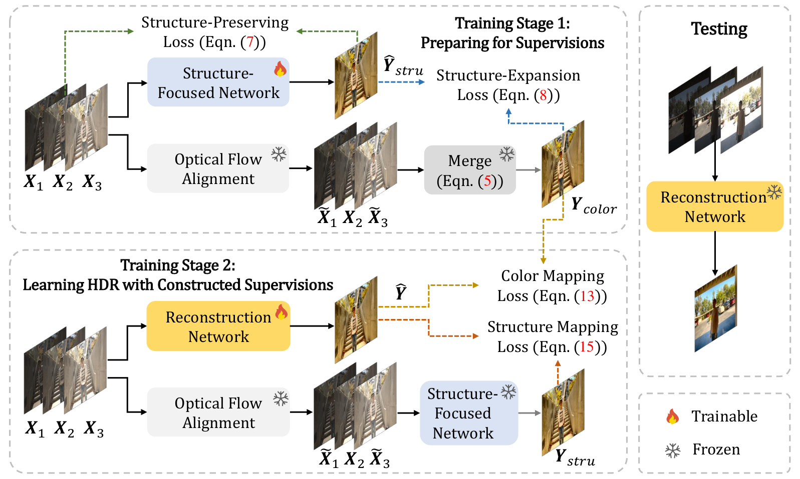
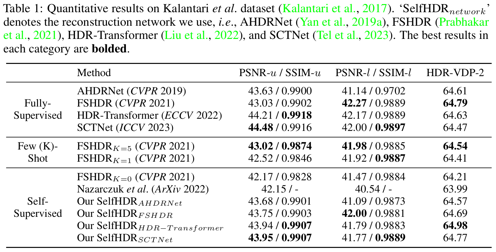

# SelfHDR (ICLR 2024)


*Official PyTorch implementation of **SelfHDR** (ICLR 2024)* 


> [**Self-Supervised High Dynamic Range Imaging with Multi-Exposure Images in Dynamic Scenes**](https://arxiv.org/abs/2310.01840)<br>
> ICLR 2024<br>
> [Zhilu Zhang](https://scholar.google.com/citations?user=8pIq2N0AAAAJ&hl=zh-CN&oi=ao)$^1$, [Haoyu Wang](./)$^1$, [Shuai Liu](./), [Xiaotao Wang](./), [Lei Lei](./), [Wangmeng Zuo](https://scholar.google.com/citations?hl=zh-CN&user=rUOpCEYAAAAJ)$^1$
<br>$^1$ Harbin Institute of Technology, China

[**OpenReview**](https://openreview.net/forum?id=jjiOHEcS2c) &nbsp; | &nbsp;   [](https://arxiv.org/abs/2310.01840) &nbsp; | &nbsp;  


<p align="center"></p>

## News

* **`2024-05-01`:** *Codes for image alignment, HDR image tone mapping visualization, and HDR-VDP metric calculation are released.*

* **`2024-02-04`:** *We organize the Bracketing Image Restoration and Enhancement Challenge in [NTIRE 2024](https://cvlai.net/ntire/2024/) (CVPR Workshop), including [Track 1 (BracketIRE Task)](https://codalab.lisn.upsaclay.fr/competitions/17573) and [Track 2 (BracketIRE+ Task)](https://codalab.lisn.upsaclay.fr/competitions/17574). Details can bee seen in [BracketIRE](https://github.com/cszhilu1998/BracketIRE/tree/master/NTIRE2024/README.md). Welcome to participate!*

* **`2024-01-24`:** *The basic codes and pre-trained models are released. (The codes have been restructured. If there are any problems with the codes, please contact us.)*

* **`2024-01-17`:** *Our SelfHDR is accepted a poster paper in [ICLR 2024](https://openreview.net/forum?id=jjiOHEcS2c).*

* **`2024-01-01`:** *In our latest work [BracketIRE](https://arxiv.org/abs/2401.00766), we utilize bracketing photography to unify image restoration and enhancement (including  denoising, deblurring, high dynamic range imaging, and super-resolution) tasks.*


## 1. Abstract


Merging multi-exposure images is a common approach for obtaining high dynamic range (HDR) images, with the primary challenge being the avoidance of ghosting artifacts in dynamic scenes. Recent methods have proposed using deep neural networks for deghosting. However, the methods typically rely on sufficient data with HDR ground-truths, which are difficult and costly to collect. In this work, to eliminate the need for labeled data, we propose SelfHDR, a self-supervised HDR reconstruction method that only requires dynamic multi-exposure images during training. Specifically, SelfHDR learns a reconstruction network under the supervision of two complementary components, which can be constructed from multi-exposure images and focus on HDR color as well as structure, respectively. The color component is estimated from aligned multi-exposure images, while the structure one is generated through a structure-focused network that is supervised by the color component and an input reference (\eg, medium-exposure) image. During testing, the learned reconstruction network is directly deployed to predict an HDR image. Experiments on real-world images demonstrate our SelfHDR achieves superior results against the state-of-the-art self-supervised methods, and comparable performance to supervised ones. 
<!-- 
<p align="center"></p>
<p align="center">Overview of our proposed SelfHDR framework.</p>

- During training, we first construct color and structure components (*i.e.*, $Y_{color}$ and $Y_{stru}$), then take $Y_{color}$ and $Y_{stru}$ for supervising the HDR reconstruction network. Dotted lines with different colors represent different loss terms.
- During testing, the HDR reconstruction network can be used to predict HDR images from unseen multi-exposure images.  -->


## 2. Preparation, datasets and pre-trained models

### 2.1 Prerequisites
- Python 3.x and **PyTorch 1.12**.
- OpenCV, NumPy, Pillow, timm, tqdm, imageio, lpips, scikit-image and tensorboardX.

### 2.2  Dataset and Pre-Trained Models
- Dataset and pre-trained models can be downloaded from this [link](https://pan.baidu.com/s/1XsIiXmN_5wn_dfz4SsyTNA?pwd=i7fc).
- Place the pre-trained models in the `./pretrained_models/` folder.

### 2.3  Image Alignment

- In the dataset, the folders ending with `_align` contain aligned multi-exposure images.
- We adopt the same alignment method with [FSHDR](https://openaccess.thecvf.com/content/CVPR2021/html/Prabhakar_Labeled_From_Unlabeled_Exploiting_Unlabeled_Data_for_Few-Shot_Deep_HDR_CVPR_2021_paper.html). The alignment codes can be seen in https://github.com/Susmit-A/FSHDR/tree/master/matlab_liu_code.
    

## 3. Quick Start


### 3.1 Training

- Modify `dataroot`, `name`, `net`, `batch_size`, `niter`, `lr_decay_iters`, and `lr` in `train.sh`:
    - Training settings for [AHDRNet](https://arxiv.org/abs/1904.10293) and [FSHDR](https://openaccess.thecvf.com/content/CVPR2021/html/Prabhakar_Labeled_From_Unlabeled_Exploiting_Unlabeled_Data_for_Few-Shot_Deep_HDR_CVPR_2021_paper.html):
        - `batch_size`=16, `niter`=150, `lr_decay_iters`=50, `lr`=0.0001 
    - Training settings for [HDR-Transformer](https://arxiv.org/abs/2208.05114) and [SCTNet](https://arxiv.org/abs/2305.18135):
        - `batch_size`=8, `niter`=200, `lr_decay_iters`=100, `lr`=0.0002 
        
- Run [`sh train.sh`](train.sh)

### 3.2 Testing

- Modify `dataroot`, `name`, `net` and `iter` in `test.sh`
- Run [`sh test.sh`](test.sh)

### 3.3 Tone Mapping and HDR-VDP Calculation

- We adopt `hdrvdp-2.2.2` toolkit, and you can download it from this [link](https://sourceforge.net/projects/hdrvdp/files/hdrvdp/2.2.2/).
- Then we write code in `Contents.m` and execute it.
- Code example in `Contents.m`:

```
    % Load HDR Images
    target = double(hdrread('tatget.hdr')); 
    out = double(hdrread('output.hdr'));

    % HDR Output Tone Mapping Visualization
    tonemap_img = tonemap(out, 'AdjustLightness', [0,1], 'AdjustSaturation', 5.3);
    imwrite(tonemap_img, 'tonemap.png');

    % Calculate HDR-VDP Metric 
    ppd = hdrvdp_pix_per_deg(24, [size(out,2) size(out,1)], 0.5);
    metric = hdrvdp(target, out, 'sRGB-display', ppd);
    
    % Print Value of HDR-VDP Metric
    metric.Q 
```

### 3.4 Note

- You can specify which GPU to use by `--gpu_ids`, e.g., `--gpu_ids 0,1`, `--gpu_ids 3`, `--gpu_ids -1` (for CPU mode). In the default setting, all GPUs are used.
- You can refer to [options](./options/base_options.py) for more arguments.


<!-- 
## 4. Results

<p align="center"></p> -->


## 4. Citation
If you find it useful in your research, please consider citing:

    @inproceedings{SelfHDR,
        title={Self-Supervised High Dynamic Range Imaging with Multi-Exposure Images in Dynamic Scenes},
        author={Zhang, Zhilu and Wang, Haoyu and Liu, Shuai and Wang, Xiaotao and Lei, Lei and Zuo, Wangmeng},
        booktitle={ICLR},
        year={2024}
    }

If you are interested in our follow-up work, i.e., [Exposure Bracketing is All You Need](https://github.com/cszhilu1998/BracketIRE), please consider citing:

    @article{BracketIRE,
        title={Exposure Bracketing is All You Need for Unifying Image Restoration and Enhancement Tasks},
        author={Zhang, Zhilu and Zhang, Shuohao and Wu, Renlong and Yan, Zifei and Zuo, Wangmeng},
        journal={arXiv preprint arXiv:2401.00766},
        year={2024}
    }

## 5. Acknowledgement

This repo is built upon the framework of [CycleGAN](https://github.com/junyanz/pytorch-CycleGAN-and-pix2pix), and we borrow some codes from [AHDRNet](https://github.com/liuzhen03/AHDRNet), [FSHDR](https://github.com/Susmit-A/FSHDR), [HDR-Transformer](https://github.com/liuzhen03/HDR-Transformer-PyTorch) and [SCTNet](https://github.com/Zongwei97/SCTNet). Thanks for their excellent works!
    
